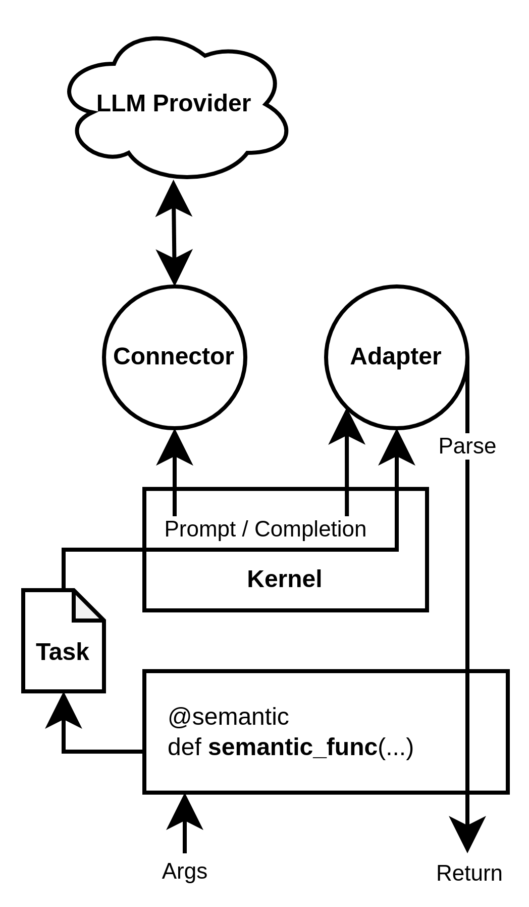

# Servitor


Easily create "semantic functions" which use LLMs as a black box to execute the given task.

```python
>>> @semantic
... def list_people(text) -> list[str]:
...     """List people mentioned in the given text."""
...
>>> list_people("John and Mary went to the store.")
["John", "Mary"]
```

[Internals](src/servitor)

This project is licensed under the [MIT license](LICENSE).

## Setup
To install everything the old way:
```bash
$ pip install -r servitor/requirements.txt
```

Or to install just the dependencies you need:
```bash
$ # Install your provider of choice
$ cd <project root>/
$ pip install .[openai]
$ pip install .[gpt4all]
```

Then import like this:
```python
>>> from servitor import semantic
```

## Configuration
Auto-GPT style .env is supported by `DefaultKernel` and its singleton `semantic` with the following variables as defaults:
* `OPENAI_API_KEY` - OpenAI API key (currently required, later optional when other providers are added).
* `OPENAI_ORGANIZATION` - OpenAI organization ID for identification.
* `MODEL_PATH` - Path of the model binary to load and save for GPT4All.
* `ALLOW_DOWNLOAD` - Whether or not to allow GPT4All to download the model (default: true)
* `MODEL` - Model to use - searches registered Connectors for a model with this name. (default: `gpt-3.5-turbo`)
* `TEMPERATURE` - Temperature, "how random" it is from 0 to 2. (default: `0`)
* `TOP_P` - Top-P logit filtering. (default: `0.9`)
* `TOP_K` - Top-K logit filtering. (default: `0`)
* `BEST_OF` - Number of completions to generate and return the best of. (default: `1`)
* `FREQUENCY_PENALTY` - Frequency penalty - penalizes repetition. (default: `0`)
* `PRESENCE_PENALTY` - Presence penalty - penalizes mentioning more than once. (default: `0`)
* `MAX_TOKENS` - Maximum number of tokens to return. (default: `1000`)
* `RETRY` - Maximum number of times to try fixing an unparseable completion. (default: `3`)
* `REQUEST_RATE` - Maximum number of requests per period. (default: `60`)
* `TOKEN_RATE` - Maximum number of tokens per period. (default: `250000`)
* `PERIOD` - Period in seconds. (default: `60`)

`Kernel` requires a `Connector` and an `Adapter` to be passed to its constructor.

In addition, `Kernel` instantiation and decorating can take either a `config` kw-only argument or kwargs with these names:
* `api_key`
* `organization`
* `model_path`
* `allow_download`
* `model`
* `temperature`
* `top_p`
* `best_of`
* `frequency_penalty`
* `presence_penalty`
* `max_tokens`
* `retry`
* `request_rate`
* `token_rate`
* `period`
* `stop` - A list of strings to stop generation at.

## Tips
Getting language models to do what you want is like wrestling a greased pig, and even a framework like servitor can only mitigate this. Here are some tips for getting the best results:
* Break your functions down into smaller pieces. The less you ask, and the fewer the parameters, the more reliable the results will be.
* Play with the generation parameters like `temperature`, `top_p`, `frequency_penalty`, and `presence_penalty`.
* Try different models. Models have different capabilities, weaknesses, and strengths.
* Tuple outputs sound like a good idea, but they probably aren't.
  - There are some special rules in the `TypeAdapter` to handle the LLM outputting tuples instead of lists (since JSON doesn't have tuples), but generally if a function is returning more than one thing, it's too complicated and will confuse it.
* If it still disobeys, try few-shot prompting. The `TypeAdapter` prompt is carefully crafted to be zero-shot to preserve tokens, but it can be worth adding examples to semantic functions which are called less often.
* Higher temperatures need lower top_p and top_k to be reliable - temperatures above 1 are prone to producing garbage otherwise.

## Providers
Currently servitor supports the following LLM providers:
* OpenAI
* GPT4All

Wish list:
* Anthropic (API request made)
* HuggingFace (model names might conflict with GPT4All?)
* AI21
* Cohere
* GooseAI
* Bard (API request made)

## Feature wish list
Some of these are partially implemented or untested:
* Better support for custom / non-JSON types, especially NamedTuple and dataclasses.
* Stream subfields of a JSON response.
* Custom parser for common LLM mistakes
  - Currently use HJSON, but it doesn't have tuples or sets which LLMs like to generate as non-JSON.
  - Some LLMs will try to embed function calls, eg MongoDB queries like `{"$gt": Date.now()}`.
  - They like to surround generation with backticks, or prepend with `return`
* JSONformer support
* Method detection and proper wrapping
* Integration with OpenAI's brand new function API
* Tree of Thought adapter
* Automatic executive function? Break up big tasks into smaller tasks automatically
* Better error recovery / retry logic
* Support for `@overload` (essentially multidispatch)

## How it works
Servitor has the following components:
* **Adapter** - Interface between the natural language of the LLM and the programmatic logic of normal Python.
* **Connector** - Abstract interface for LLM provider. Currently only OpenAI is supported, but it's been designed for adding new connectors without an `openai` library dependency.
* **Completion** - A chat/text completion from an LLM.
* **Kernel** - A set of defaults and glue logic which make semantic functions work.
* **Task** - A textual task for the LLM to complete.
* **Semantic function** - A function which uses an LLM to execute a task.

First, you instantiate a kernel (`semantic` is provided for ease-of-use). Then, the kernel instance can either be called on a string (used as the prompt) or as a decorator on a function. It will call the function; if the result is None, it uses the docstring. Otherwise, it uses the result as the task. The adapter converts the task to the full prompt for the LLM and implements error-recovery logic to ensure the result is parsed into a machine-readable format. With all this, you can define a semantic function with a simple decorator, and it looks and acts exactly like a normal (async) function.

More advanced adapters use the type annotations of the function to both prompt and validate the responses of the LLM. The ones provided use HJSON (Human-JSON) which is a generalization of JSON to be more permissive of the LLM's generation, which tend to contain small parsing errors, and it typically uses many fewer tokens.

### More details


The adapter is a bidirectional generator which yields prompts, receives responses, and returns a final answer. The implementation of `Adapter` is expected to take care of the vast majority of cases, but this interface is very general to allow for more complex use-cases. The connector is simply an async callable which returns a `Completion` object. This is a thin wrapper around the raw response from the LLM, which can be used as an async iterator for streaming or as an awaitable for blocking. Currently only blocking is actually used.

## Available classes
### Adapters
All adapters are contained within `adapter.py`. Anywhere an adapter is expected, you can pass a registered string instead.
* `Adapter` - (not registered) Abstract base class for adapters.
* `TaskAdapter` - (`"task"`) Simplest adapter, just passes the prompt through to the LLM and returns the result.
* `PlainAdapter` - (`"plain"`) Prompts the LLM to give an answer rather than simply complete, but has no parsing. Mostly used as a base class for more advanced adapters.
* `TypeAdapter` - (`"type"`) Uses type annotations and HJSON to prompt and parse the result.
* `ChainOfThoughtAdapter` - (`"chain"`) Uses Chain of Thought prompting to get a more coherent response. It also wraps the result in a `ChainOfThought` named tuple `(thoughts, answer)`.

### Connectors
The common classes for connectors are in `complete.py`, but each connector has its own file which is loaded dynamically to avoid unused dependencies.
* `Connector` - Abstract base class for connectors.
* `Completion` - Wrapper for the raw response of an LLM provider.
* `Delta` - Used by completions to indicate new generated tokens.
* `openai.OpenAIConnector` - Connector for OpenAI's API.
* `openai.OpenAICompletion` - Wrapper for OpenAI's completion response.

### Kernels
All kernels are in `kernel.py`. Only two are defined:
* `Kernel` - Simple base class for kernels.
* `DefaultKernel` - Kernel implementation loading defaults from config files and ENV. It has an instance `semantic` for ease-of-use.

Kernels can be called, used as decorators (with optional arguments), or they can do an ordinary completion using `Adapter.complete`

## Examples
You can use the `semantic` singleton to define a semantic function:
```python
>>> @semantic
... def list_people(text) -> list[str]:
...     """List people mentioned in the given text."""
...
>>> list_people("John and Mary went to the store.")
["John", "Mary"]
```

You can customize the prompt by returning a string from the function:
```python
>>> @semantic
... def classify_valence(text: str) -> float:
...     return """Classify the valence of the given text as a value between -1 and 1."""
...
>>> classify_valence("I am happy.")
0.9
```

The kernel decorator can be used on classes, wrapping the `__call__` method.
```python
>>> @semantic
... class SelectTool:
...     def __init__(self, tools: list[Callable]):
...         self.tools = tools
...
...     def __call__(self, task: str) -> str:
...         """Select a tool from the given list."""
...         return f"Select a tool for the given task from this list: {list(self.tools.keys())}"
```

Plain adapter is good for simple text to text tasks:
```python
>>> @semantic(adapter="plain")
... def summarize(text) -> str:
...     """Summarize the given text in two sentences or less."""
```

Dumber models can be used for dumber tasks:
```python
>>> @semantic(model="text-ada-002", adapter="none")
... def what_is_this(text):
...     return f"{text}\n\nWhat is this?"
...
>>> what_is_this("lorem ipsum...")
"This is an example of placeholder Latin text, commonly known as Lorem Ipsum."
```

### Zork
A more advanced example is provided in [](examples/zork.py). This implements a simple Zork-like game using semantic functions as the driver. To play,
```bash
$ cd <project root>/
$ python examples/zork.py
```

It saves your progress in `private/zork.json` and you can reset it by deleting that file.

## Synchrony
Servitor preserves the async of the function definition. Decorating an async function will use the connector's async interface automatically:

```python
>>> @semantic(adapter="chain")
... async def summarize(concept: str) -> str:
... 	"""Summarize the given text in two sentences or less."""
...
>>> asyncio.run(summarize("long text..."))
"A summary."
```

## What's the point?
I've noticed a trend of people using LLMs as semi-personified agents. They're given personalities, presented with tools to select from and plan with (eg Microsoft Semantic Kernels), and generally expected to act like some kind of proto-person. This is understandable given the first truly usable instance we saw was ChatGPT, a chatbot with a very simple cognitive architecture (rolling, discrete, turn-based chat logs with an initial system prompt), however it severely limits the usability and composability that's possible. This library is intended to reframe LLMs as what they are - very good stochastic models of language - and thus treat them as a kind of natural language inference engine, which is what they're really designed for. By reifying tasks as discrete functions which can be composed with ordinary logic, programs can be given a sort of embedded intelligence which is otherwise impossible.

## What is a "servitor"?
A "[servitor](https://en.wikipedia.org/wiki/Servitor_(chaos_magic))" is a kind of artificial spirit in [chaos magick](https://en.wikipedia.org/wiki/Chaos_magic). Essentially, you create a miniature proto-consciousness which is given a specific task to perform autonomously. This might be something as simple as reminding you to wake up at a certain time, or as complex as performing a ritual on the "astral plane" on your behalf. Whether or not you believe in all that, the parallels are clear: It's a kind of AI program within your own mind which completes exactly one very specific task given to it in natural language. LLMs are more general than servitors, but restricting their capacities allows them to excel at what they're best at rather than trying to meet a standard they're not yet capable of. It's my opinion that AGI will not be a single monolithic LLM, but rather a cognitive architecture system which uses LLMs as computational units. Think of the cognitive architecture as the [Chinese Room](https://en.wikipedia.org/wiki/Chinese_room) and the LLMs as the person inside. Neither understands Chinese, but the total system does.

## Special mentions
* [Semantic Kernel](https://github.com/microsoft/semantic-kernel) - Inspired this idea when I tried to use it but got frustrated by what I perceived to be vast overengineering and a lack of composability.
* [Cataclysm](https://github.com/Mattie/cataclysm) - Uses LLMs to automatically generate Python code from metadata which is then cached. Essentially an inverse of servitor, rather than an LLM which executes a task, it's an LLM which converts a task into something executable.